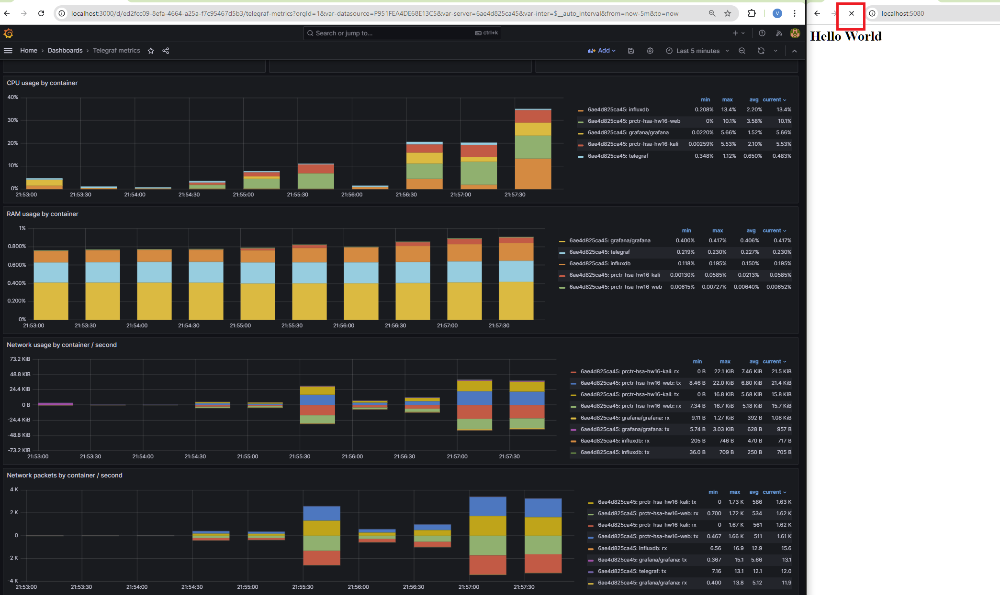

# UDP flood
```bash
docker exec -it kali /kali/scripts/udp_flood.sh
```

- kali CPU usage is much higher than nginx
- Network load is equal for kali and nginx (126k packets/sec)
- UDP ports were opened in docker image
- Limiting nginx container to 10% didn't make problem
- Seems like single machine can't make DDoS of this kind


# ICMP flood
```bash
docker compose exec kali bash -c "ping web"

    PING web (172.26.0.5) 56(84) bytes of data.
    64 bytes from web.prctr-hsa-hw16_network1 (172.26.0.5): icmp_seq=1 ttl=64 time=0.075 ms
    64 bytes from web.prctr-hsa-hw16_network1 (172.26.0.5): icmp_seq=2 ttl=64 time=0.092 ms
```

```bash
docker-compose exec --user root web sh -c "iptables -A INPUT -p icmp --icmp-type echo-request -j DROP"
docker-compose exec --user root web sh -c "iptables -L -v -n"

    Chain INPUT (policy ACCEPT 6 packets, 419 bytes)
    pkts bytes target     prot opt in     out     source               destination
        0     0 DROP       icmp --  *      *       0.0.0.0/0            0.0.0.0/0            icmptype 8

    Chain FORWARD (policy ACCEPT 0 packets, 0 bytes)
    pkts bytes target     prot opt in     out     source               destination

    Chain OUTPUT (policy ACCEPT 4 packets, 524 bytes)
    pkts bytes target     prot opt in     out     source               destination
```

```bash
docker compose exec kali bash -c "ping web"
    PING web (172.26.0.5) 56(84) bytes of data.
```

- ICMP flood makes no effect on the target


# HTTP flood
- HTTP flood actually made the site unavaialble



# slowloris
- slowloris worked


# SYN flood
- Didn't affect the target
